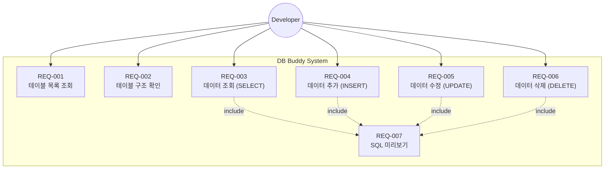
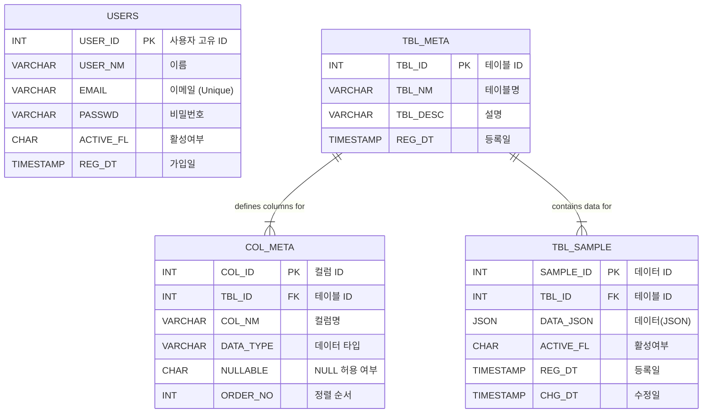

# 📌 프로젝트 소개 (Project Introduction)

## 프로젝트 이름
**DB Buddy**

---

## 1️⃣ 프로젝트 개요

**GUI 기반 CRUD 학습용 웹 DBMS**

이 프로젝트는 SQL 문을 직접 작성하지 않아도, 버튼과 입력폼을 통해 CRUD(Create, Read, Update, Delete)를 수행하고, 내부에서 어떤 SQL이 실행되는지 직관적으로 확인할 수 있는 교육용 웹 도구입니다.

- **목표**: SQL 문 구조와 DB 동작 원리를 직관적으로 이해
- **특징**: SQL 직접 입력 X / 안전한 범위 내 CRUD / GUI 기반

---

# 📌 기획 (Planning)

## 2️⃣ 요구사항 상세 (Requirements Specification)

### 기능 요구사항 목록

| ID | 분류 | 요구사항 명 | 설명 | 중요도 |
|:---:|:---:|:---|:---|:---:|
| **REQ-001** | 테이블 | 테이블 목록 조회 | DB에 존재하는 모든 테이블 목록을 확인한다. | 상 |
| **REQ-002** | 테이블 | 테이블 구조 확인 | 특정 테이블의 컬럼 정보(타입, NULL 여부 등)를 상세 조회한다. | 상 |
| **REQ-003** | 데이터 | 데이터 조회 (SELECT) | 선택한 컬럼에 대한 SELECT 쿼리를 생성하고 실행 결과를 확인한다. | 상 |
| **REQ-004** | 데이터 | 데이터 추가 (INSERT) | 입력 폼을 통해 새로운 데이터를 테이블에 추가한다. | 상 |
| **REQ-005** | 데이터 | 데이터 수정 (UPDATE) | PK를 기준으로 특정 행의 데이터를 수정한다. | 중 |
| **REQ-006** | 데이터 | 데이터 삭제 (DELETE) | PK를 기준으로 특정 행을 삭제한다. | 중 |
| **REQ-007** | 유틸리티 | SQL 미리보기 | GUI 동작 시 실제로 실행되는 SQL 문을 화면에 표시한다. | 상 |

### 제한 사항
- **SQL 직접 입력 불가**: 사용자가 임의의 SQL을 작성하여 실행할 수 없다.
- **복잡한 쿼리 제한**: JOIN, 서브쿼리, 자유로운 WHERE 절 입력은 지원하지 않는다.
- **단건 처리**: UPDATE와 DELETE는 PK를 기준으로 한 번에 한 건씩만 처리한다.

---

## 3️⃣ 시스템 설계

### 3.1 유스케이스 (Use Case)

개발자가 시스템을 통해 수행하는 기능을 요구사항 ID와 매핑하여 보여주는 다이어그램입니다.



### 3.2 ERD (Entity Relationship Diagram)

프로젝트에서 사용하는 데이터베이스 스키마 구조입니다. 메타데이터 기반으로 동적인 테이블 관리가 가능하도록 설계되었습니다.



---

# 📌 개발자 가이드 (Developer Guide)

## 4️⃣ 팀원 역할 (예시)

| 역할 | 담당 |
|------|------|
| 팀장(전공자) | 전체 구조 설계, Spring Boot + MyBatis 설정, 통합 테스트 |
| 팀원1 | DB 테이블/컬럼 정의, 샘플 데이터 삽입 |
| 팀원2 | 테이블 목록/컬럼 체크 UI, SELECT 문 미리보기 |
| 팀원3 | Create / Update 폼 구현 |
| 팀원4 | Delete 기능, SELECT 실행 결과 표시 |

> 참고: 모두 개발자로 참여, 기능 단위로 역할 분담

---

## 5️⃣ 프로젝트 진행 전략

1. 팀장이 전체 구조 설계 및 초기 API 구현
2. DB 담당이 테이블과 샘플 데이터 준비
3. UI 담당이 컬럼 체크박스 및 SELECT 미리보기 구현
4. CRUD 담당이 Create/Update/Delete 폼 제작
5. 팀장 통합 테스트 및 최종 검증

---

## 6️⃣ 트러블슈팅 (DB 연결 문제 해결)

애플리케이션 실행 시 DB 연결 권한 오류(`Access denied`, `DROP command denied`)가 발생할 경우, 아래 SQL을 **ROOT 계정**으로 실행하여 사용자를 생성하고 권한을 부여하세요.

```sql
-- 1. 사용자 생성 (localhost 전용)
CREATE USER IF NOT EXISTS 'swcamp'@'localhost' IDENTIFIED BY 'swcamp';

-- 2. 권한 부여 (모든 권한)
GRANT ALL PRIVILEGES ON GUI_CRUD_DBMS.* TO 'swcamp'@'localhost';

-- 3. 권한 적용
FLUSH PRIVILEGES;
```
