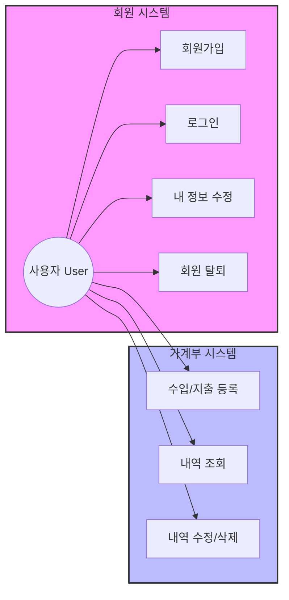
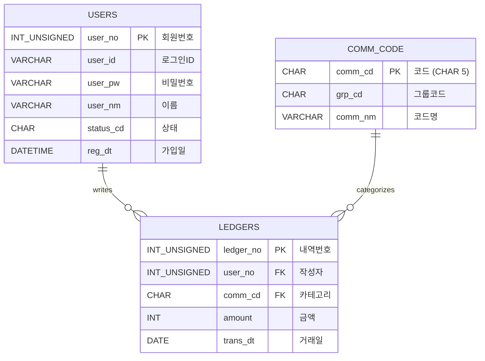

# 📒 Household Ledger (가계부 프로젝트) - Team 2

팀 2의 가계부 관리 프로젝트입니다. Spring Boot와 MyBatis, MariaDB를 기반으로 구축되었습니다.

## 👨‍👩‍👦‍👦 팀원 및 역할 (Team Members)

| 이름 | 역할 | 담당 파트 |
|---|---|---|
| **정진호** | **Team Leader** | **공통 설계 / DB / 로그인 / 통합** |
| **윤성원** | Developer | **회원 관리** (가입, 수정, 탈퇴) |
| **정병진** | Developer | **가계부 CRUD** (내역 등록/조회) |
| **최현지** | Developer | **통계 & 조회** (차트, 필터링) |
| **김태형** | Documentation | **문서화 & 알림** (사용 가이드) |

---

## 🛠 기술 스택 (Tech Stack)

- **Language**: Java 17
- **Framework**: Spring Boot 3.5.9
- **Persistence**: MyBatis 3.0.5
- **Database**: MariaDB
- **Build Tool**: Gradle

---

## 📝 요구사항 명세 (Requirements Specification)

### 1. 회원 관리 (Member Management)
*담당: 윤성원*
- **회원가입**: 아이디(중복확인), 비밀번호, 이름, 이메일 입력.
- **로그인**: 세션 기반 인증.
- **회원 정보**: 본인 정보 조회 및 수정.
- **회원 탈퇴**: `status_cd`를 'N'으로 변경 (Soft Delete).

### 2. 가계부 관리 (Ledger CRUD)
*담당: 정병진*
- **카테고리**: 공통 코드(`comm_cd`)를 사용하여 수입/지출 분류.
- **등록**: 날짜, 금액, 카테고리, 메모 입력.
- **조회**: 전체 내역 최신순 조회.
- **수정/삭제**: 본인이 작성한 내역만 처리 가능.

### 3. 통계 및 조회 (Statistics)
*담당: 최현지*
- **월별 통계**: 이번 달 총 수입/지출액 표시.
- **카테고리별 통계**: 식비, 교통비 등 카테고리별 지출 비중 확인.
- **필터링**: 기간별, 카테고리별 내역 조회.

### 4. 알림 및 문서 (Docs)
*담당: 김태형*
- **문서화**: 팀 프로젝트 기능 정의 및 가이드 작성.
- **알림**: 예산 초과 시 알림 로직 설계 (옵션).

---

## 🏛 기획 및 설계 (Design & Architecture)

### 1. 유스케이스 다이어그램 (Use Case Diagram)
**`graph LR`** 을 사용하여 표현한 사용자 기능 흐름입니다.



### 2. 데이터베이스 설계 (ERD)

**Q. 왜 공통 코드 PK(`comm_cd`)는 `CHAR(5)`인가요?**
> 일반적으로 PK는 Auto Increment(`INT`)를 많이 쓰지만, 공통 코드는 성격이 다릅니다.
> 1.  **고정된 길이**: 코드는 `INC01`, `EXP01` 처럼 규칙과 길이가 정해져 있으므로 `CHAR`가 저장 효율 및 검색 속도 면에서 유리할 수 있습니다.
> 2.  **직관성(가독성)**: `101`번 코드보다 `INC01`(Income 01)이 코드 자체만으로 의미를 파악하기 쉽습니다. (디버깅 용이)
> 3.  **조인 성능**: 고정 길이 문자열은 인덱싱 및 조인 시 성능 예측이 용이합니다.



---

## 🚀 개발 가이드 (Development Guide)

### 1. DB 연결 및 초기화
로컬 MariaDB에 `household_ledger` 데이터베이스를 생성하고 아래 사용자 계정을 확인하세요.
- URL: `jdbc:mariadb://localhost:3306/household_ledger`
- User: `root` / Password: `1234`
- **필수**: 하단 스크립트의 **DB 함수(`fn_get_comm_nm`)** 생성 구문을 반드시 실행해야 합니다.

### 2. 공통 코드 설명 (Common Code Reference)
본 프로젝트에서 사용하는 주요 그룹 코드(`grp_cd`)입니다.

| 그룹 코드 | 의미 | 예시 (`comm_cd`) |
|---|---|---|
| **INC** | 수입 (Income) | `INC01`(월급), `INC02`(용돈) |
| **EXP** | 지출 (Expense) | `EXP01`(식비), `EXP02`(교통비) |

### 3. DB 함수 사용법 (`fn_get_comm_nm`) 상세
코드명을 가져올 때는 무조건 이 함수를 사용합니다.

**기본 문법:**
```sql
SELECT fn_get_comm_nm('코드값'); -- 결과: '코드명'
```

**실전 활용 (MyBatis):**
```xml
<select id="getLedgerList" resultType="LedgerDTO">
    SELECT 
        ledger_no, 
        amount, 
        -- 조인 없이 함수 호출만으로 코드명을 가져옵니다.
        fn_get_comm_nm(comm_cd) AS category_nm 
    FROM ledgers
    WHERE user_no = #{userNo}
</select>
```

### 3. 네이밍 규칙 (Naming Convention) 준수
팀원 간 코드 통일성을 위해 아래 규칙을 꼭 지켜주세요.
- **Java Field**: `camelCase` (예: `userId`, `userNm`)
- **DB Column**: `snake_case` + 접미사 (예: `user_id`, `user_nm`, `reg_dt`)
- **API URL**: 소문자 + 하이픈 (예: `/api/v1/user-info`)

---

## 📜 설치 및 실행 (Setup)

### 1. DB 초기화 (SQL 실행)
MariaDB 클라이언트에서 아래 스크립트를 실행하세요. (**함수 생성 포함**)

```sql
DROP DATABASE IF EXISTS household_ledger;
CREATE DATABASE household_ledger;
USE household_ledger;

-- 1. 회원 테이블
CREATE TABLE users (
    user_no INT UNSIGNED AUTO_INCREMENT PRIMARY KEY,
    user_id VARCHAR(20) NOT NULL UNIQUE,
    user_pw VARCHAR(100) NOT NULL,
    user_nm VARCHAR(30) NOT NULL,
    status_cd CHAR(1) DEFAULT 'Y',
    reg_dt DATETIME DEFAULT CURRENT_TIMESTAMP
);

-- 2. 공통 코드 테이블 (CHAR PK 사용 이유: 성능 및 가독성)
CREATE TABLE comm_code (
    comm_cd CHAR(5) PRIMARY KEY,
    grp_cd CHAR(3) NOT NULL,
    comm_nm VARCHAR(30) NOT NULL,
    sort_no TINYINT DEFAULT 1
);

-- 3. 가계부 테이블
CREATE TABLE ledgers (
    ledger_no INT UNSIGNED AUTO_INCREMENT PRIMARY KEY,
    user_no INT UNSIGNED NOT NULL,
    comm_cd CHAR(5) NOT NULL,
    amount INT NOT NULL,
    trans_dt DATE NOT NULL,
    status_cd CHAR(1) DEFAULT 'Y',
    FOREIGN KEY (user_no) REFERENCES users(user_no),
    FOREIGN KEY (comm_cd) REFERENCES comm_code(comm_cd)
);

-- [중요] 함수 생성
DELIMITER $$
CREATE FUNCTION fn_get_comm_nm(_comm_cd CHAR(5)) RETURNS VARCHAR(30)
DETERMINISTIC
BEGIN
    DECLARE _comm_nm VARCHAR(30);
    SELECT comm_nm INTO _comm_nm FROM comm_code WHERE comm_cd = _comm_cd;
    RETURN IFNULL(_comm_nm, '');
END $$
DELIMITER ;

-- 기초 데이터
INSERT INTO comm_code VALUES ('INC01', 'INC', '월급', 1);
INSERT INTO comm_code VALUES ('EXP01', 'EXP', '식비', 1);
INSERT INTO users (user_id, user_pw, user_nm) VALUES ('test', '1234', '정진호');
```
