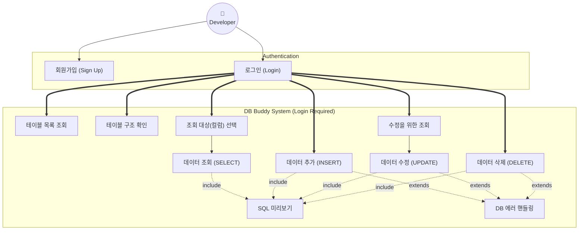

# 📌 프로젝트 소개 (Project Introduction)

## 프로젝트 이름
**DB Buddy**

---

## 1️⃣ 프로젝트 개요

**GUI 기반 CRUD 학습용 웹 DBMS**

이 프로젝트는 SQL 문을 직접 작성하지 않아도, 버튼과 입력폼을 통해 CRUD(Create, Read, Update, Delete)를 수행하고, 내부에서 어떤 SQL이 실행되는지 직관적으로 확인할 수 있는 교육용 웹 도구입니다.

- **목표**: SQL 문 구조와 DB 동작 원리를 직관적으로 이해
- **특징**: SQL 직접 입력 X / 안전한 범위 내 CRUD / GUI 기반

---

# 📌 기획 (Planning)

## 2️⃣ 요구사항 상세 (Requirements Specification)

### 기능 요구사항 목록

| ID | 분류 | 요구사항 명 | 상세 내용 | 검증 기준 (Acceptance Criteria) | 중요도 |
|:---:|:---:|:---|:---|:---|:---:|
| **REQ-001** | 계정 | 회원가입 (Sign Up) | 시스템 사용을 위한 계정을 생성한다. | - ID(Email), 비밀번호, 이름을 입력받아 `USERS` 테이블에 저장.<br>- 이메일 중복 시 가입 불가. | 상 |
| **REQ-002** | 계정 | 로그인 (Login) | 등록된 계정으로 시스템에 접속한다. | - DB에 저장된 Email/비밀번호와 일치해야 접속 성공.<br>- **로그인하지 않은 사용자는 시스템의 어떠한 기능도 사용할 수 없음 (접근 차단)**. | 상 |
| **REQ-003** | 테이블 | 테이블 목록 조회 | DB(`GUI_CRUD_DBMS`)에 존재하는 테이블 중 메타 데이터를 제외한 목록을 출력한다. | - **메타 테이블(`TBL_META`, `COL_META`, `USERS` 등)은 목록에서 제외.**<br>- 사용자가 관리하는 주요 비즈니스 테이블만 표시할 것. | 상 |
| **REQ-004** | 테이블 | 테이블 구조 확인 | 사용자가 선택한 테이블의 모든 컬럼 정보(이름, 타입, 길이, NULL 허용여부, PK 여부)를 Grid 형태로 표시한다. | - `TBL_ID` 같은 PK 컬럼은 식별 가능하도록 별도 아이콘/색상 표시.<br>- 데이터 타입(VARCHAR, INT 등)이 명확히 구분되어야 함. | 상 |
| **REQ-005** | 데이터 | 조회 대상 선택 | 사용자가 조회하고 싶은 컬럼을 체크박스로 선택할 수 있어야 한다. | - 기본적으로 '전체 선택/해제' 체크박스 제공.<br>- 하나 이상의 컬럼을 선택하지 않고 조회 시도시 "컬럼을 선택해주세요" 경고창 출력. | 상 |
| **REQ-006** | 데이터 | 데이터 조회 (SELECT) | 선택된 컬럼만 포함하여 `SELECT` 쿼리를 생성하고 실행 결과를 테이블 형태로 출력한다. | - 선택하지 않은 컬럼은 결과 테이블에 노출되지 않아야 함.<br>- 데이터가 0건일 경우 "데이터가 존재하지 않습니다" 표시. | 상 |
| **REQ-007** | 데이터 | 데이터 추가 (INSERT) | 입력 폼을 통해 새로운 데이터를 추가한다. 폼은 컬럼의 데이터 타입에 맞춰 렌더링되어야 한다. | - 필수(Not Null) 컬럼 미입력 시 저장 불가.<br>- 숫자 컬럼에 문자 입력 시 유효성 검사 실패 메시지 출력.<br>- 저장 성공 시 목록 화면으로 즉시 리다이렉트. | 상 |
| **REQ-008** | 데이터 | 수정을 위한 조회 | 수정 버튼 클릭 시, 해당 행(Row)의 현재 데이터를 입력 폼에 미리 채워둔 상태로 제공한다. | - PK(Primary Key) 값은 수정할 수 없도록 **읽기 전용(Read-only)** 처리 (disabled/readonly 속성).<br>- 기존 데이터가 정확히 매핑되어 있어야 함. | 중 |
| **REQ-009** | 데이터 | 데이터 수정 (UPDATE) | 변경된 값을 DB에 반영한다. | - 수정 전과 값이 동일할 경우 DB 요청을 보내지 않거나, "변경된 내용이 없습니다" 알림.<br>- 수정 성공 시 "수정되었습니다" 알림 후 목록 갱신. | 중 |
| **REQ-010** | 데이터 | 데이터 삭제 (DELETE) | PK를 기준으로 특정 행을 삭제한다. 삭제 전 반드시 사용자 확인을 거쳐야 한다. | - **"정말로 삭제하시겠습니까?"** 확인(Confirm) 대화상자 필수 제공.<br>- 취소 시 삭제 요청이 중단되어야 함. | 중 |
| **REQ-011** | 유틸리티 | SQL 미리보기 | 사용자의 조작(버튼 클릭 등)에 따라 실행될 SQL 문을 화면 하단 혹은 모달창에 실시간으로 표시한다. | - 사용자가 내용을 임의로 수정할 수 없도록 `readonly` 처리.<br>- 바인딩된 파라미터 값이 쿼리에 포함되어 보이거나, `?`와 매핑 정보를 함께 표시. | 상 |
| **REQ-012** | 예외처리 | DB 에러 핸들링 | 외래키(FK) 제약조건 위반, 중복 키 등 DB 레벨의 에러 발생 시 사용자 친화적인 메시지를 출력한다. | - `SQLIntegrityConstraintViolationException` 발생 시 "참조 데이터가 없거나 중복된 키입니다" 등으로 변환 출력.<br>- 원본 에러 스택 트레이스는 화면에 노출 금지. | 중 |

### 제한 사항
- **SQL 직접 입력 불가**: 사용자가 임의의 SQL을 작성하여 실행할 수 없다.
- **권한 제어**: 모든 기능(조회 포함)은 **로그인한 사용자만** 이용 가능하다. 비로그인 시 로그인 페이지로 강제 이동된다.

---

## 3️⃣ 시스템 설계

### 3.1 유스케이스 (Use Case)

개발자가 시스템을 통해 수행하는 기능을 요구사항 ID와 매핑하여 보여주는 다이어그램입니다.



### 3.2 ERD (Entity Relationship Diagram)

프로젝트에서 사용하는 데이터베이스 스키마 구조입니다. 메타데이터 기반으로 동적인 테이블 관리가 가능하도록 설계되었습니다.


---

# 📌 개발자 가이드 (Developer Guide)

## 4️⃣ 팀원 역할 (예시)

| 역할 | 담당 |
|------|------|
| 팀장(전공자) | 전체 구조 설계, Spring Boot + MyBatis 설정, 통합 테스트 |
| 팀원1 | DB 테이블/컬럼 정의, 샘플 데이터 삽입 |
| 팀원2 | 테이블 목록/컬럼 체크 UI, SELECT 문 미리보기 |
| 팀원3 | Create / Update 폼 구현 |
| 팀원4 | Delete 기능, SELECT 실행 결과 표시 |

> 참고: 모두 개발자로 참여, 기능 단위로 역할 분담

---

## 5️⃣ 프로젝트 진행 전략

1. 팀장이 전체 구조 설계 및 초기 API 구현
2. DB 담당이 테이블과 샘플 데이터 준비
3. UI 담당이 컬럼 체크박스 및 SELECT 미리보기 구현
4. CRUD 담당이 Create/Update/Delete 폼 제작
5. 팀장 통합 테스트 및 최종 검증

---

## 6️⃣ 트러블슈팅 (DB 연결 문제 해결)

애플리케이션 실행 시 DB 연결 권한 오류(`Access denied`, `DROP command denied`)가 발생할 경우, 아래 SQL을 **ROOT 계정**으로 실행하여 사용자를 생성하고 권한을 부여하세요.

```sql
-- 1. 사용자 생성 (localhost 전용)
CREATE USER IF NOT EXISTS 'swcamp'@'localhost' IDENTIFIED BY 'swcamp';

-- 2. 권한 부여 (모든 권한)
GRANT ALL PRIVILEGES ON GUI_CRUD_DBMS.* TO 'swcamp'@'localhost';

-- 3. 권한 적용
FLUSH PRIVILEGES;
```
